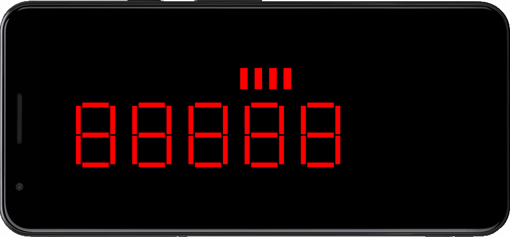
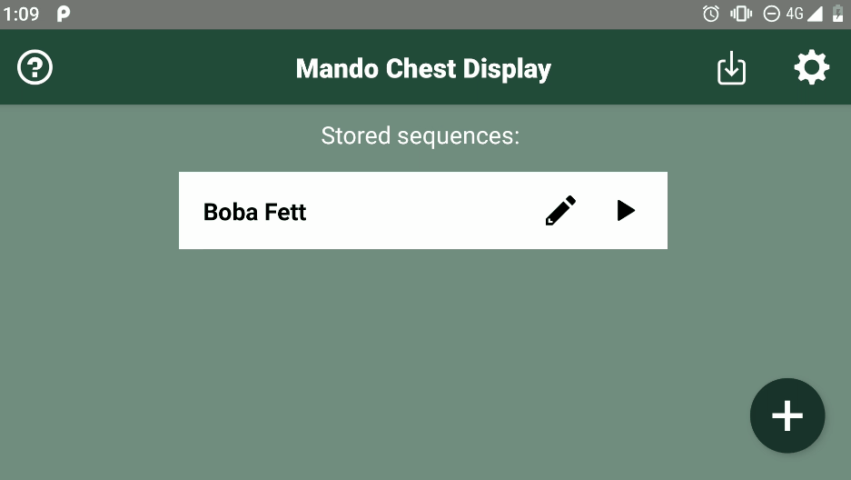
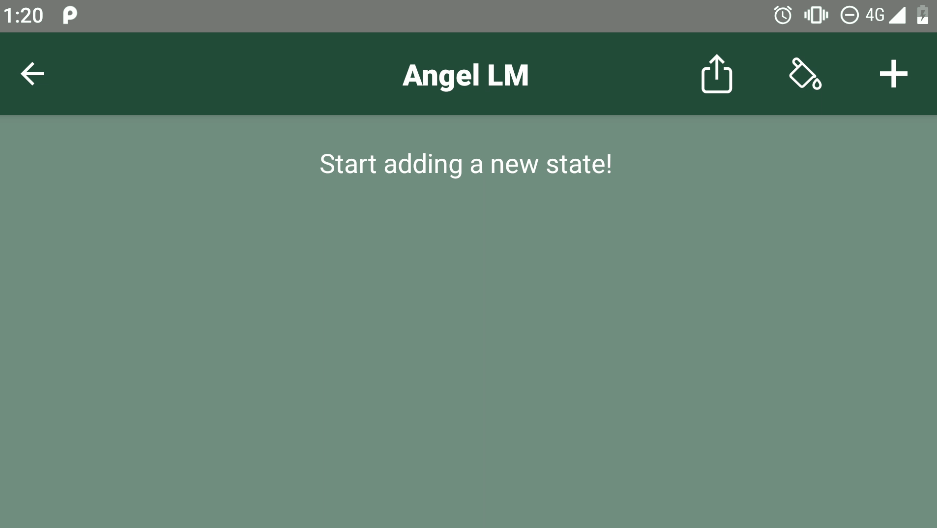
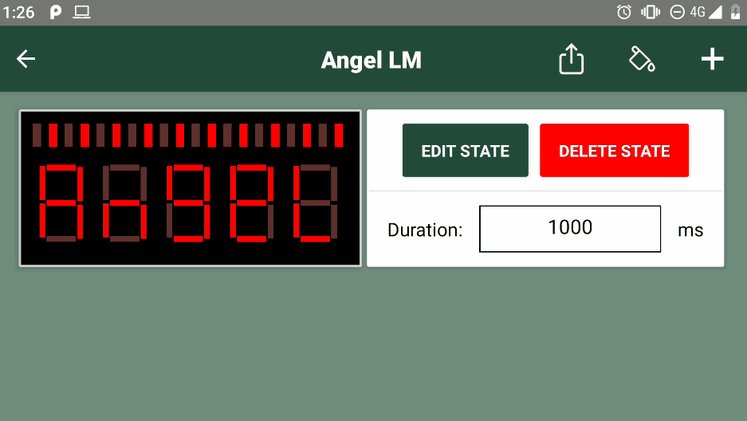
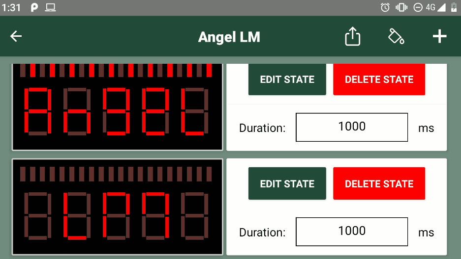
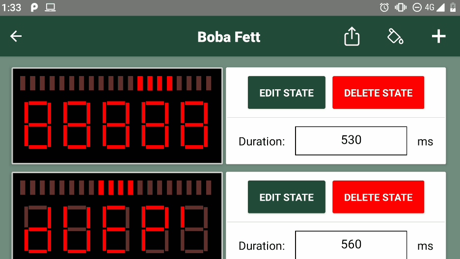
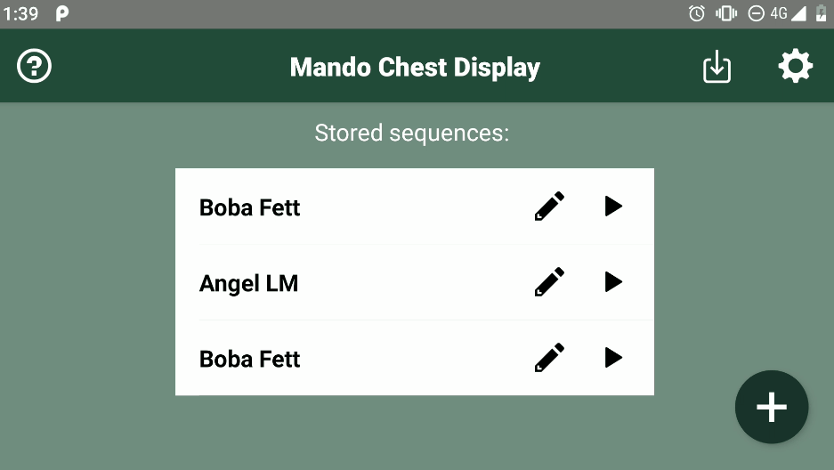
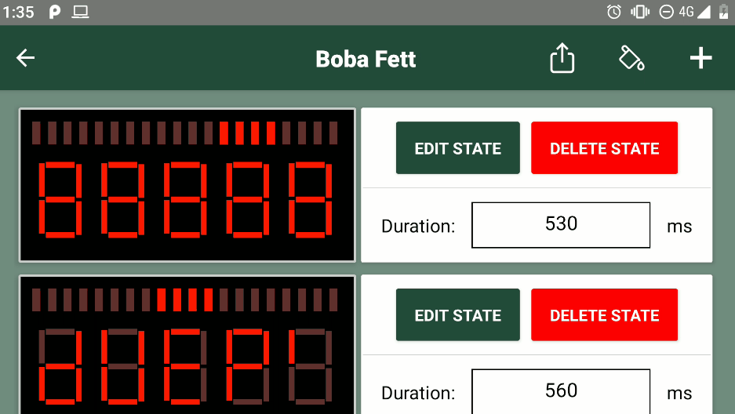
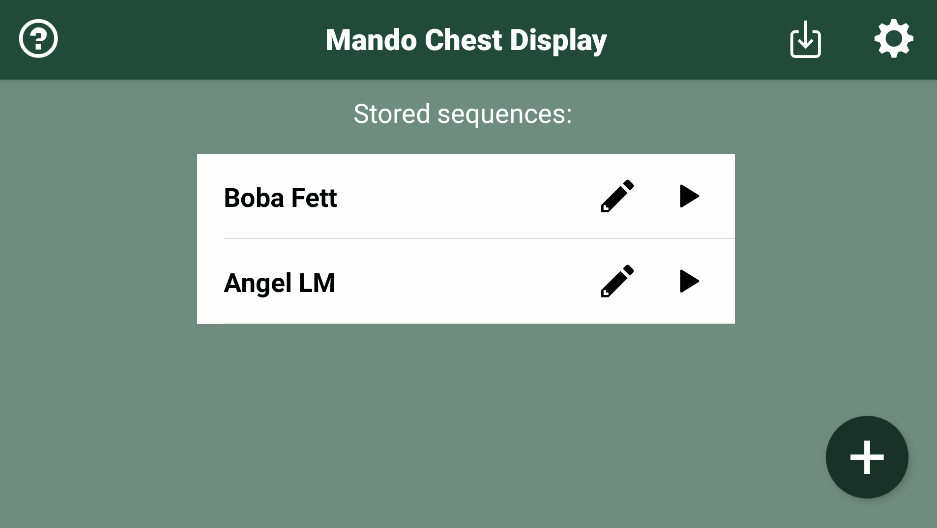
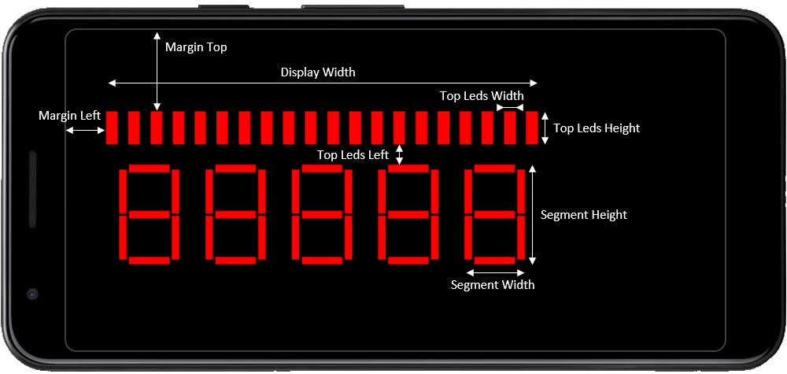

# Mando Chest Display (MCD)


MandoDisplayApp or "Mando Chest Display (MCD)" is an app that recreates the chest display of Boba Fett, character of Star Wars films.

The app allows the user to create, store and display sequences.

The last version of this app can be downloaded [here](https://github.com/AngelLM/MandoDisplayApp/releases).



# Features
## Adding a new sequence


Create a new sequence is easy as clicking the + button at the bottom right of the screen, introducing the sequence name and pressing the "CREATE" button.

## Editing a sequence
To access to the sequence editor, press the pencil icon of the sequence you want to edit. Inside the sequence editor you can add new states, edit the current ones, modify the duration of each state and change the color of the LEDs.

### Adding a new state


To add a new state, click the + button located on the top bar. A new screen will appear. By default, the LEDs of the new state will be all OFF. You can light them ON by clicking over them. When finished, click on the "ADD STATE" button to save the state.

### Edit a state


To edit a state, just click over the "EDIT" button of the state you want to modify. A new screen with the state will appear. When you are done editing it, press the "EDIT STATE" button to save the changes.

### Delete a state


To delete a state, click over the "DELETE" button of the state you want to delete. A dialog will appear, asking for confirmation.

### Modify state duration


To change the state duration, press over the duration input box and modify the value.

## Change the color of a sequence


By default the sequence color is red, but you can change it clicking on the paint bucket icon located on the top bar. A new screen will appear. Pick the color of your choice and apply the changes by pressing the "SET COLOR" button.

## Delete a sequence


In order to delete a sequence, perform a long press over the sequence you want to delete until a dialog appears asking for confirmation.

## Export / Import a sequence


To export a sequence (to share it or to keep it as a backup) go to the sequence editor. Once there, press the export icon located on the top bar. A new screen will appear with a code. Press the button "COPY TO CLIPBOARD" to copy the code of the sequence to the clipboard. Paste wherever you want to share or save it!

To import a sequence, press the import icon located on the top bar of the main screen. Paste the sequence code into the input box and press "IMPORT" to add the state.

This is the code of the Boba Fett sequence:
```
MCD/Boba Fett/#ff0000/000000000000111100001111111011111110111111101111111011111110/530/000000001111000000000111101001111100100111101100111000000100/560/000000000000000011111010111010011110111010101111101000001110/530/000000000000000000000100001000100100100100000000110011000010/800/000011110000000000000111101001111100100111101100111000000100/560/111100000000000000000110111000110110110110101110011000001100/530/000000000000000000000110111010111100110110101111111010001100/800/MCD
```


## Edit Display Sizes


As there are many different screen sizes/resolution, it may be convenient to adjust the size and position of the display. It can be done by clicking over the gear button located on the top bar of the main screen. A new screen with many value inputs will appear. Each of those values correspond to the following distances (in pixels):



While you are changing the settings, you can test them by clicking the "TEST" button. A screen with all leds ON will appear to preview the settings. To save the settings, press the "SAVE SETTINGS" button.


# License
All files included in this repository are licensed under [GNU General Public License v3.0](https://choosealicense.com/licenses/gpl-3.0/)
